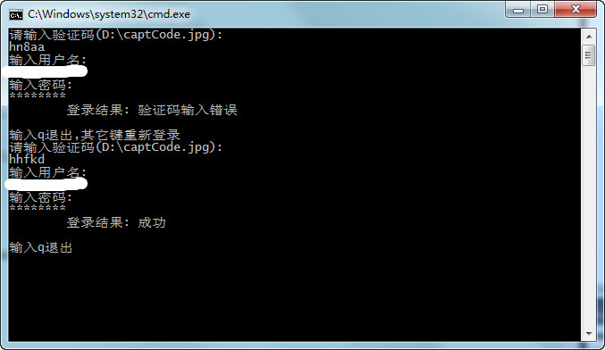

##### 说明
学习sockets实现的Https通信,实现了长连接模式。

实现了小米账号的登录，学习了小米验证码的流程。

小米的网页加载方式和其它的网站不太一样，使用Chrome无法直接查看加载的资源，使用的啥技术还不知道。

登录成功后，尝试获取账号的个人信息，结果是失败的。


##### 截图




##### 知识点

openssl的使用，js的调试，HTTPS的抓包，长连接的实现，cookie的处理，服务器资源的接收和处理，验证码机制。


##### 接收服务器资源代码

原来使用了网上的接收代码，测试发现接收数据不完全问题，特地改写了下。

```cpp
	bool bHttpHeadHead = false;
	bool bHttpHeadTail = false;
	char recvData[1025] = { 0 };
	do
	{
		int nErr = SSL_read(m_ssl, recvData, 1024);
		if (nErr > 0)
		{ 
			recvData[nErr] = 0;
			int nLen = strRecv.length() - 15;
			nLen < 0 ? nLen = 0 : 1;
			strRecv.append(recvData, nErr);
			// 查找http头部
			if (bHttpHeadHead == false)
			{
				const char * pHttp = strstr(strRecv.c_str() + nLen, "HTTP/1.");
				if (pHttp)
					bHttpHeadHead = true;
			}
			// 找到http头部，找http头部结尾
			if (bHttpHeadHead == true)
			{
				// Content-Length: 不一定有，但是\r\n\r\n一定会有
				const char * pContent = strstr(strRecv.c_str() + nLen, "\r\n\r\n");
				if (pContent)
				{
					// 第一次Copntent数据就接受完毕了
					if (nErr < 1024)
						break;
					bHttpHeadTail = true;
				}
				// Http尾部找到了，
				if (bHttpHeadTail)
				{
					if (pContent == NULL && nErr < 1023)
						break;
				}
			}	
		}
		if (nErr <= 0) // 最后接收的小于1024有几秒的延时
			break;
	} while (1);
```


